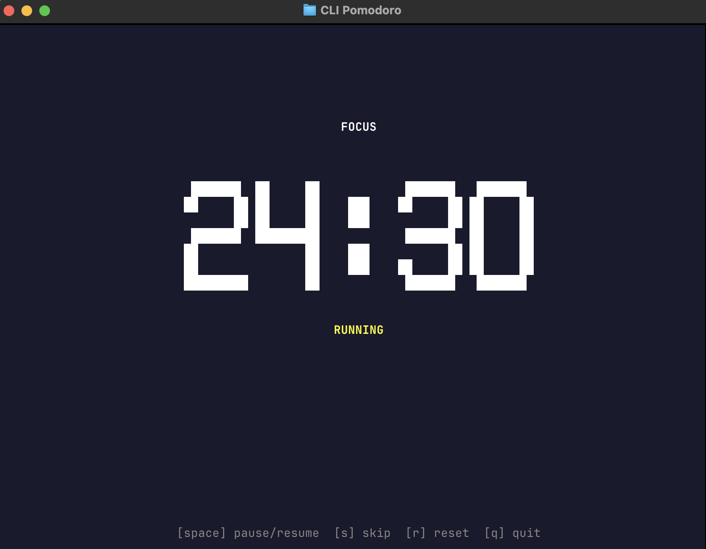

# CLI Pomodoro

A beautiful, full-screen terminal-based Pomodoro timer built with Go. Stay focused without leaving your command line environment.




## ✨ Features

- **🎯 Full-Screen Experience**: Immersive, distraction-free timer that takes over your entire terminal
- **⏰ Classic Pomodoro Technique**: 25-minute focus sessions with automatic break management
- **🎨 Beautiful ASCII Art**: Large, easy-to-read countdown timer with stunning visual design
- **🎭 Dynamic Theming**: Background colors change based on session type (focus vs. break)
- **⌨️ Keyboard-Driven**: Complete control without touching your mouse
- **⚡ Lightweight & Fast**: Minimal resource usage, won't slow down your system
- **🖥️ Cross-Platform**: Works on macOS, Linux, and Windows

## 🚀 Installation

### Install from Source

```bash
go install github.com/toml5566/cli-pomodoro/cmd/cli-pomodoro@latest
```

### Build Locally

```bash
git clone https://github.com/toml5566/cli-pomodoro.git
cd cli-pomodoro
make build
```

The binary will be created in the `bin/` directory.

## 🎮 Usage

Start your Pomodoro session with a single command:

```bash
cli-pomodoro
```

Or if running from source:

```bash
make run
```

The application will launch in full-screen mode and immediately start a 25-minute focus session.

### Pomodoro Cycle

The timer follows the classic Pomodoro Technique:

1. **Focus Session** (25 minutes) - Deep work time
2. **Short Break** (5 minutes) - Quick rest
3. **Repeat 4 times**
4. **Long Break** (15 minutes) - Extended rest
5. **Cycle repeats**

## ⌨️ Keyboard Controls

| Key | Action |
|-----|--------|
| `Space` | Pause/Resume timer |
| `s` | Skip current session |
| `r` | Reset current session to full duration |
| `q` or `Ctrl+C` | Quit application |

## 🎨 Visual Experience

The application provides a rich visual experience:

- **Focus Sessions**: Dark blue background with white ASCII timer
- **Short Breaks**: Green-blue background for quick rest periods  
- **Long Breaks**: Darker blue-green background for extended rest
- **Large ASCII Timer**: Easy-to-read `MM:SS` format using block characters
- **Status Indicators**: Clear display of current session type and timer state
- **Help Footer**: Always-visible keyboard shortcuts at the bottom

## 🛠️ Technical Details

### Built With

- **[Go](https://golang.org/)** - Fast, reliable, and efficient programming language
- **[Bubble Tea](https://github.com/charmbracelet/bubbletea)** - Powerful TUI framework for terminal applications
- **[Lip Gloss](https://github.com/charmbracelet/lipgloss)** - Style definitions for terminal applications

### Requirements

- Go 1.24.0 or later (for building from source)

### Architecture

The application follows the Model-View-Update (MVU) pattern provided by Bubble Tea:

- **Model**: Manages timer state, session progression, and user interactions
- **View**: Renders the beautiful ASCII interface with dynamic styling
- **Update**: Handles keyboard input and timer events

## 🔧 Development

### Project Structure

```
cli-pomodoro/
├── cmd/
│   └── cli-pomodoro/
│       └── main.go          # Application entry point
├── internal/
│   └── app/
│       ├── model.go         # Core TUI logic and state management
│       └── constant.go      # Timer durations, ASCII art, and styling constants
├── bin/                     # Built binaries
├── Makefile                 # Build automation
├── go.mod                   # Go module dependencies
├── go.sum                   # Dependency checksums
├── LICENSE                  # License file
├── cli-pomodoro.png         # Application screenshot
└── README.md                # Project documentation
```

### Running in Development

```bash
git clone https://github.com/toml5566/cli-pomodoro.git
cd cli-pomodoro
make run
```

### Building

```bash
# Build for current platform
make build

# Cross-compile for different platforms
GOOS=linux GOARCH=amd64 go build -o bin/cli-pomodoro-linux cmd/cli-pomodoro/main.go
GOOS=windows GOARCH=amd64 go build -o bin/cli-pomodoro-windows.exe cmd/cli-pomodoro/main.go
GOOS=darwin GOARCH=amd64 go build -o bin/cli-pomodoro-macos cmd/cli-pomodoro/main.go
```

### Make Commands

- `make run` - Run the application directly from source
- `make build` - Build the binary to `bin/cli-pomodoro`

## 🤝 Contributing

Contributions are welcome! Please feel free to submit a Pull Request. For major changes, please open an issue first to discuss what you would like to change.

## 📝 License

This project is licensed under the MIT License - see the [LICENSE](LICENSE) file for details.

## 📞 Support

If you encounter any issues or have questions:

1. Check the [Issues](https://github.com/toml5566/cli-pomodoro/issues) page
2. Create a new issue if your problem isn't already reported
3. Include your terminal type, OS, and Go version when reporting bugs

---

**Stay focused, stay productive! 🍅**
